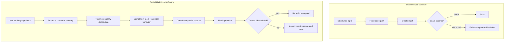
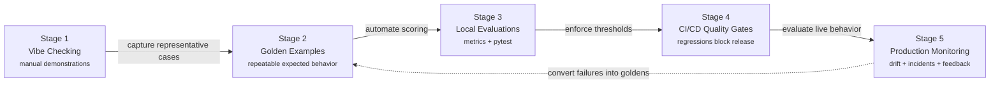
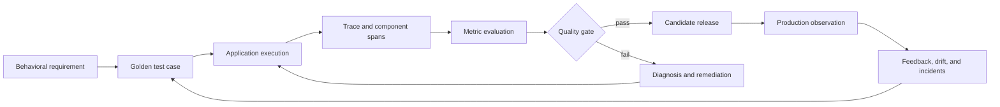

# DeepEval: Production-Grade Testing and Evaluation for LLM Applications

This repository is the documentation companion to the twelve-chapter technical
manuscript on evaluation-first development with DeepEval. It is organized as a
progressive engineering handbook: begin with the failure of exact-match testing,
learn how metrics convert subjective behavior into measurable evidence, then
scale those evaluations through tracing, datasets, CI/CD, monitoring, red
teaming, and governance.

The examples target Python 3.11+ and the DeepEval 4.x API family. They are
designed to complement an executable DeepEval test repository while remaining
self-contained as a documentation portal.

## Who this guide is for

- QA and test automation engineers moving into AI quality engineering.
- LLM application developers who need repeatable regression protection.
- Solutions architects designing RAG, agent, and conversational systems.
- Platform and DevOps teams establishing model-aware deployment gates.
- Product, risk, and compliance leaders who need auditable quality evidence.

## Prerequisites

| Requirement | Recommended baseline | Why it matters |
|---|---:|---|
| Python | 3.11 or newer | Modern typing, package compatibility, and CI parity |
| DeepEval | 4.x | Metrics, datasets, tracing, and Pytest integration |
| Pytest | 8.x or newer | Test discovery, filtering, fixtures, and reporting |
| Evaluator access | OpenAI, Azure OpenAI, Anthropic, or a custom judge | Required by LLM-as-a-judge metrics |
| Version control | Git | Prompts, goldens, thresholds, and evaluations are code |
| CI system | GitHub Actions or equivalent | Automated quality gates on every change |

## Book navigation

### Part I — Foundations of LLM Quality Engineering

1. [The LLM Evaluation Crisis](docs/chapter1_crisis.md)
2. [Your First DeepEval Test](docs/chapter2_basics.md)

### Part II — Metrics: The Core Evaluation Engine

3. [Understanding Metrics Like an Evaluator](docs/chapter3_metrics.md)
4. [Custom Metrics: G-Eval and DAG](docs/chapter4_custom.md)

### Part III — Evaluating Real AI Systems

5. [RAG Evaluation: Retriever to Final Answer](docs/chapter5_rag.md)
6. [Agent Evaluation and Tool Use](docs/chapter6_agent.md)
7. [Conversational and Multimodal Evaluations](docs/chapter7_conv_multi.md)

### Part IV — Building Evaluation Infrastructure

8. [Tracing, Observability, and Component Evaluations](docs/chapter8_observability.md)
9. [Synthetic Data and Golden Datasets](docs/chapter9_synthetic.md)

### Part V — Scaling Across Teams

10. [CI/CD and Confident AI](docs/chapter10_cicd.md)
11. [Production Monitoring and Red Teaming](docs/chapter11_monitoring.md)
12. [The Future of AI Quality Engineering](docs/chapter12_future.md)

## Deterministic logic and probabilistic token sampling



Traditional tests verify whether a known operation produced a known result.
LLM evaluations verify whether a variable output satisfies explicit behavioral
requirements. Both disciplines remain necessary: deterministic assertions
protect schemas, permissions, calculations, and tool arguments; semantic
metrics evaluate relevance, grounding, safety, and task success.

## AI Quality Maturity Model



Maturity is cumulative. Production monitoring does not replace local tests, and
CI does not replace well-designed datasets. Each stage adds a new control loop
while retaining the assets created in earlier stages.

## The evaluation lifecycle



## Reading and implementation strategy

Each chapter follows a shared pattern:

1. Define the quality problem in system and business terms.
2. Identify the test-case evidence needed to evaluate it.
3. Select deterministic checks, model-graded metrics, or both.
4. Establish thresholds using labeled examples rather than intuition.
5. Capture component traces so failures are diagnosable.
6. Feed real failures back into version-controlled datasets.

For a first implementation, read Chapters 1–5, create ten to twenty goldens,
and place one RAG or answer-quality suite in CI. Add agent and conversation
metrics only when those architectures exist in the product. Add production
monitoring before broad rollout, not after the first incident.

## Core commands

```bash
python3 -m venv .venv
source .venv/bin/activate
python -m pip install deepeval pytest python-dotenv

pytest -v
pytest -v -k "rag"
deepeval test run tests/
```

Keep credentials in `.env.local`, a secret manager, or CI secrets. Never store
provider keys in tests, notebooks, datasets, traces, or documentation examples.

## Documentation conventions

- `input` means the user or upstream component request.
- `actual_output` means the observed application response.
- `expected_output` describes an ideal response or required outcome.
- `context` is reference material available to the evaluator.
- `retrieval_context` is the evidence returned by a retriever.
- A **trace** represents one end-to-end execution.
- A **span** represents one component or operation inside that execution.
- A **golden** is a reusable evaluation input with reference expectations.

## Important limitation

Evaluation scores are evidence, not proof. An excellent faithfulness score does
not establish legal compliance, clinical safety, or freedom from every attack.
High-risk systems require domain experts, deterministic controls, human review,
incident procedures, and governance in addition to automated metrics.
