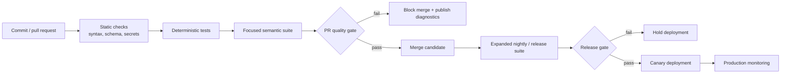
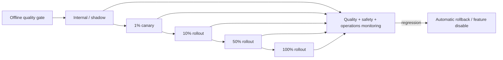

# Chapter 10 — CI/CD and Confident AI

[← Chapter 9](chapter9_synthetic.md) · [Master index](../README.md) ·
[Next: Production Monitoring →](chapter11_monitoring.md)

## Learning objectives

This chapter converts local evaluations into release controls, defines layered
CI execution, provides a complete GitHub Actions workflow, and explains shared
evaluation reporting and governance through platforms such as Confident AI.

## Quality gates as deployment policy

A quality gate is an enforceable rule:

```text
Release is blocked when:
- any critical privacy or authorization case fails;
- faithfulness p10 falls below 0.80;
- median answer relevancy falls below 0.85;
- the candidate regresses more than 0.02 against main;
- tool authorization failures exceed zero.
```

The policy should identify:

- metric and threshold;
- dataset and slice;
- whether failure blocks merge or deployment;
- owner and escalation path;
- exception and expiration process.

## Layered pipeline



Fast, focused suites belong on pull requests. Broader and more expensive suites
can run nightly or before release. Critical deterministic controls remain in
every lane.

## Complete GitHub Actions workflow

```yaml
name: DeepEval Continuous Quality Gate

on:
  pull_request:
    branches: [main, develop]
  push:
    branches: [main]
  workflow_dispatch:

permissions:
  contents: read

concurrency:
  group: deepeval-${{ github.workflow }}-${{ github.ref }}
  cancel-in-progress: true

jobs:
  evaluate:
    name: Python 3.11 LLM evaluation
    runs-on: ubuntu-latest
    timeout-minutes: 30

    env:
      OPENAI_API_KEY: ${{ secrets.OPENAI_API_KEY }}
      OPENAI_MODEL_NAME: ${{ vars.OPENAI_MODEL_NAME }}
      CONFIDENT_API_KEY: ${{ secrets.CONFIDENT_API_KEY }}
      DEEPEVAL_TELEMETRY_OPT_OUT: "1"

    steps:
      - name: Check out repository
        uses: actions/checkout@v4

      - name: Set up Python
        uses: actions/setup-python@v5
        with:
          python-version: "3.11"
          cache: pip
          cache-dependency-path: requirements.txt

      - name: Install pinned dependencies
        run: |
          python -m pip install --upgrade pip
          python -m pip install --requirement requirements.txt

      - name: Validate source and dataset syntax
        run: |
          python -m compileall -q app tests
          python -m json.tool datasets/production_goldens.json >/dev/null

      - name: Run deterministic tests
        run: pytest -v -m "not live_eval"

      - name: Require evaluator credentials
        shell: bash
        run: |
          if [[ -z "${OPENAI_API_KEY}" ]]; then
            echo "::error::OPENAI_API_KEY is required for semantic evaluation."
            exit 1
          fi

      - name: Run DeepEval quality gates
        run: deepeval test run tests/ -v
```

Pin third-party actions to reviewed commit SHAs in high-security environments.
Use protected environments for deployment credentials.

## Secret management

CI should receive only the credentials needed by that job:

- evaluator API key;
- optional shared reporting key;
- read-only test data access;
- no production mutation credentials.

Prevent untrusted forked pull requests from accessing secrets. Avoid executing
arbitrary contributor code in a privileged evaluation job.

## Reproducibility

Record in the CI artifact:

- commit SHA;
- dependency lock or pinned requirements;
- application and prompt version;
- model and evaluator identifiers;
- dataset version;
- metric configuration;
- run time and environment;
- per-example scores and reasons;
- trace links where permitted.

Without this evidence, a future reviewer cannot reconstruct why a release
passed.

## Flakiness policy

Model-graded tests can fluctuate near thresholds. Do not hide that instability
with unlimited retries.

Recommended controls:

- calibrate away from ambiguous boundaries;
- use strict deterministic checks for zero-tolerance behavior;
- allow a small, documented retry policy only for provider/transient failures;
- distinguish infrastructure error from quality failure;
- manually review repeated borderline cases;
- improve criteria or labels when judge disagreement is high.

## Baseline comparisons

Absolute thresholds protect minimum quality. Relative comparisons protect
against regressions:

```text
Candidate passes when:
1. all critical absolute thresholds pass; and
2. candidate median does not decline beyond tolerance versus approved main; and
3. no protected slice experiences a material drop.
```

Compare on the same dataset, source snapshot, evaluator, and metric version.

## Shared reporting and Confident AI

A centralized evaluation platform can provide:

- historical experiment tracking;
- branch and candidate comparisons;
- shared datasets;
- trace inspection;
- score trends;
- team annotations and review;
- production monitoring continuity.

The platform does not replace repository controls. Keep prompts, metric
configuration, critical datasets, and CI policy versioned with code. Cloud
reporting should make evidence easier to share, not make the release process
unreproducible outside a dashboard.

## Rollout policy

Evaluation passing should lead to progressive delivery:



Offline success raises confidence. Canary monitoring verifies behavior under
real traffic and infrastructure.

## CI failure triage

| Failure | Owner | Action |
|---|---|---|
| Syntax or schema | Engineering | Correct code or data format |
| Provider timeout | Platform | Retry within policy; inspect status |
| Critical policy case | Product/risk + engineering | Block and investigate |
| Broad metric regression | AI team | Compare examples, prompt, model, retrieval |
| One outdated golden | Dataset owner | Correct label with review |
| Unexpected cost spike | Platform/AI team | Inspect token and trace changes |

## Common mistakes

### Running the entire expensive suite on every keystroke

Layer execution by risk and lifecycle.

### Allowing averages to hide critical failures

Use per-case or per-slice gates for safety-sensitive behavior.

### Treating reruns as a fix

Repeatedly rerunning until green destroys the meaning of the gate.

### Secrets in fork workflows

Separate trusted and untrusted execution paths.

### CI without production rollback

A gate reduces risk but cannot predict every real-world failure.

## Chapter checklist

- [ ] Quality gates map to business risks and owners.
- [ ] Pull-request and release suites are appropriately layered.
- [ ] Dependencies, actions, datasets, prompts, and models are versioned.
- [ ] Secrets are minimally scoped and protected from untrusted code.
- [ ] Critical cases cannot be hidden by averages.
- [ ] Infrastructure failures are separated from quality failures.
- [ ] Results and trace evidence are retained for review.
- [ ] Passing CI leads to progressive rollout and monitoring.

[← Chapter 9](chapter9_synthetic.md) · [Master index](../README.md) ·
[Next: Production Monitoring →](chapter11_monitoring.md)

