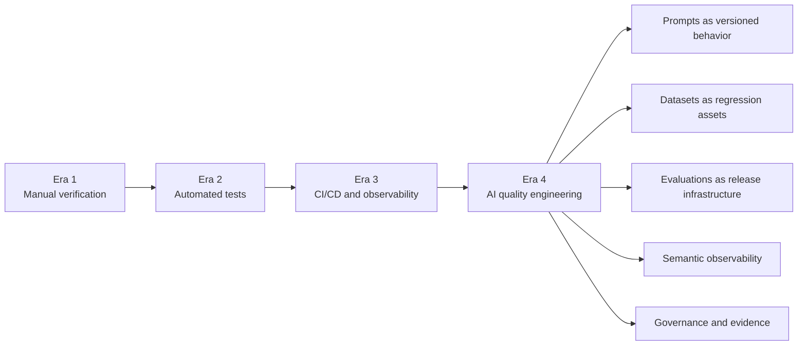
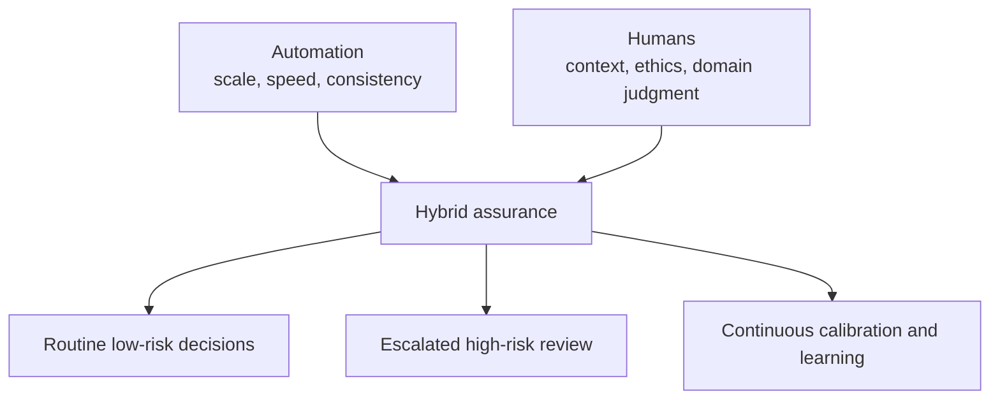
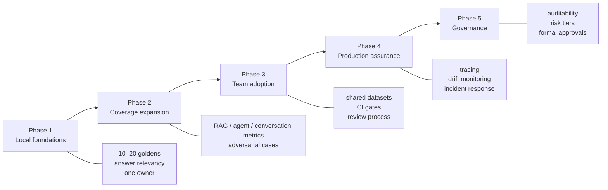

# Chapter 12 — The Future of AI Quality Engineering

[← Chapter 11](chapter11_monitoring.md) · [Master index](../README.md)

## Learning objectives

This chapter frames AI quality engineering as an organizational discipline,
maps the evolution of QA skills, identifies emerging evaluation trends,
provides an adoption roadmap, and closes with the full eight-point production
readiness failsafe checklist.

## From testing outputs to engineering trust

Traditional QA asks whether a system followed a deterministic specification.
AI quality engineering additionally asks:

- Is the behavior grounded and relevant?
- Did the agent choose authorized tools and complete the task?
- Did conversation state remain accurate and isolated?
- Is quality changing across prompts, models, users, or time?
- Can the organization explain why a release was approved?
- Can it detect, mitigate, and learn from a production failure?

The discipline combines software testing, data quality, model evaluation,
observability, security, domain review, and governance.

## Evolution of the testing function

## Skills evolution matrix

| Traditional QA capability | AI quality extension |
|---|---|
| Functional test design | Behavioral and semantic evaluation |
| API testing | Tool-call and agent-action verification |
| Test data management | Golden datasets and synthetic generation |
| Regression automation | Metric portfolios and threshold calibration |
| CI/CD integration | Model-aware quality gates |
| Performance testing | Token, cost, latency, and step efficiency |
| Security testing | Prompt injection, leakage, and jailbreak analysis |
| Production monitoring | Semantic drift and live quality evaluation |
| Defect reporting | Trace-based component diagnosis |
| Requirements analysis | Executable evaluation criteria and rubrics |

Strong QA fundamentals remain highly valuable: boundary analysis, equivalence
classes, risk-based testing, traceability, reproducibility, and skeptical
thinking all transfer directly.

## Evaluations as infrastructure

Evaluations influence:

- deployment approval;
- model and prompt selection;
- vendor comparison;
- risk and compliance review;
- incident response;
- product prioritization;
- customer trust.

They therefore require reliability, ownership, security, documentation, and
change control. A fragile notebook owned by one engineer is not evaluation
infrastructure.

## Human and automated judgment

Automation is effective for broad screening and regression detection. Humans
remain essential for ambiguous policy, high-impact decisions, ethical context,
novel incidents, and evaluator calibration.

## Emerging trends

### Agent-first evaluation

Systems will increasingly involve multiple agents, delegated tasks, shared
memory, and tool ecosystems. Evaluation will need to assess coordination,
authorization, handoffs, planning quality, and system-level outcomes.

### Cross-modal quality

Text, image, audio, video, documents, and structured data will be evaluated as
connected evidence. Perception and reasoning failures must remain separable.

### Synthetic scale with stronger verification

Synthetic data will expand coverage, while provenance, deduplication, expert
review, and contamination controls become more important.

### Real-time assurance

Some evaluations will move inline as guardrails or policy engines. Latency and
failure-mode design will matter: the system must define what happens if an
evaluator is unavailable.

### Standardization and auditability

Organizations will need consistent records of datasets, metric definitions,
model versions, approvals, incidents, and remediation. Evaluation artifacts
will increasingly serve as governance evidence.

### Evaluator evaluation

Teams will formally benchmark judge models, monitor disagreement, and route
borderline cases through multiple evaluators or humans.

## Adoption roadmap

### Phase 1 — Local foundations

- Identify one important user journey.
- Create a small, reviewed golden dataset.
- Add one or two distinct metrics.
- Run evaluations locally and inspect reasons.

### Phase 2 — Coverage expansion

- Add boundary, ambiguity, adversarial, and failure-recovery cases.
- Separate component metrics for RAG or agents.
- Establish threshold calibration.

### Phase 3 — Team adoption

- Put datasets and metric configuration under review.
- Run focused suites in CI.
- Publish results and ownership.
- Train product, QA, and engineering contributors.

### Phase 4 — Production assurance

- Instrument traces and spans.
- Monitor semantic, safety, operational, and user signals.
- Add progressive rollout and rollback.
- Convert incidents into regression assets.

### Phase 5 — Governance

- Define risk tiers and mandatory controls.
- Preserve approval evidence.
- Establish exception, audit, and incident processes.
- Review vendors, evaluators, and data handling.

## Organizational maturity questions

| Question | Evidence of maturity |
|---|---|
| Do goldens exist? | Versioned, reviewed dataset with stable IDs |
| Are prompt changes evaluated? | CI run tied to pull request |
| Can poor quality block deployment? | Protected quality gate |
| Are component failures diagnosable? | Traces with retriever/generator/tool spans |
| Is production behavior monitored? | Quality and safety dashboards with alerts |
| Are incidents retained as tests? | Documented incident-to-golden workflow |
| Is ownership clear? | Named metric, dataset, system, and policy owners |
| Can decisions be audited? | Versioned run evidence and approvals |

## Common misconceptions

### “Evaluations eliminate humans”

They scale and structure judgment; they do not eliminate domain expertise or
ethical responsibility.

### “One high score proves safety”

Safety is multi-dimensional and adversarial. Scores reduce uncertainty but
cannot prove absence of harm.

### “Evaluation slows innovation”

Fast, trustworthy feedback enables safer experimentation and shorter diagnosis.

### “Only large enterprises need this”

Small teams benefit greatly from avoiding repeated failures and key-person
judgment.

### “A framework solves quality”

Tools execute a quality strategy. They do not define product requirements,
risk tolerance, ownership, or governance.

## Eight-point Production Readiness Failsafe Checklist

The following checklist is intentionally complete and should be reviewed before
every material production launch.

### 1. Dataset maturation

- [ ] We maintain high-fidelity, version-controlled golden datasets covering
      core user intents.
- [ ] Datasets include happy paths, ambiguity, boundaries, adversarial cases,
      recovery behavior, and protected high-risk slices.
- [ ] Expected behavior is reviewed by qualified domain owners and tied to
      policy versions.

### 2. Pipeline automation

- [ ] Evaluation suites execute automatically for relevant pull requests,
      releases, and scheduled runs.
- [ ] Dependencies, models, prompts, metrics, and datasets are versioned.
- [ ] Infrastructure failures are distinguishable from quality failures.

### 3. Boundary validation

- [ ] Edge cases, missing information, malformed input, unsupported languages,
      and conflicting constraints have been tested.
- [ ] RAG, agent, conversation, and multimodal components are evaluated at the
      appropriate boundaries.
- [ ] Exact invariants use deterministic assertions.

### 4. Quality gate policies

- [ ] Non-negotiable metric thresholds and zero-tolerance controls are defined.
- [ ] Critical failures cannot be hidden by averages.
- [ ] Gate ownership, exceptions, expiration, and escalation are documented.

### 5. Live telemetry tracking

- [ ] Production traces capture enough sanitized evidence to diagnose behavior.
- [ ] Quality, safety, operational, and user signals are monitored.
- [ ] Drift is segmented by prompt, model, index, tool, language, intent, and
      other relevant versions.

### 6. Adversarial safeguards

- [ ] The architecture has been tested against direct and indirect prompt
      injection, jailbreaks, PII and secret leakage, toxicity, bias, and unsafe
      advice.
- [ ] Tool outputs and retrieved documents are treated as untrusted data.
- [ ] High-impact actions have deterministic authorization and confirmation.

### 7. Incident response protocols

- [ ] Detection, severity assessment, mitigation, rollback, investigation, and
      recurrence prevention are documented.
- [ ] On-call and domain-review responsibilities are clear.
- [ ] Production failures become sanitized regression goldens.

### 8. Clear system ownership

- [ ] Application, prompt, model, dataset, metric, policy, tool, and monitoring
      owners are named.
- [ ] Cross-functional review exists across engineering, QA, product, security,
      domain experts, and compliance where applicable.
- [ ] Evaluation and release evidence can be audited.

## Practical next actions

### This week

- Write one meaningful DeepEval test for a high-value behavior.
- Identify one deterministic safety invariant.

### This month

- Build and review a small golden dataset.
- Calibrate a metric against known good and bad examples.

### This quarter

- Add quality gates to CI.
- Instrument retriever, generator, agent, or tool spans.
- Run an authorized adversarial review.

### This year

- Establish production quality monitoring.
- Formalize incident-to-dataset feedback.
- Define risk tiers, ownership, and evaluation governance.

## Closing perspective

The central question is not whether an LLM application occasionally produces a
good answer. It is whether the organization can measure behavior intentionally,
detect regressions quickly, diagnose failures precisely, control high-impact
actions, and learn continuously from real use.

Evaluation-first development converts uncertainty into managed evidence. That
evidence does not make AI infallible. It makes teams more capable of building
systems worthy of the trust users place in them.

[← Chapter 11](chapter11_monitoring.md) · [Master index](../README.md)

