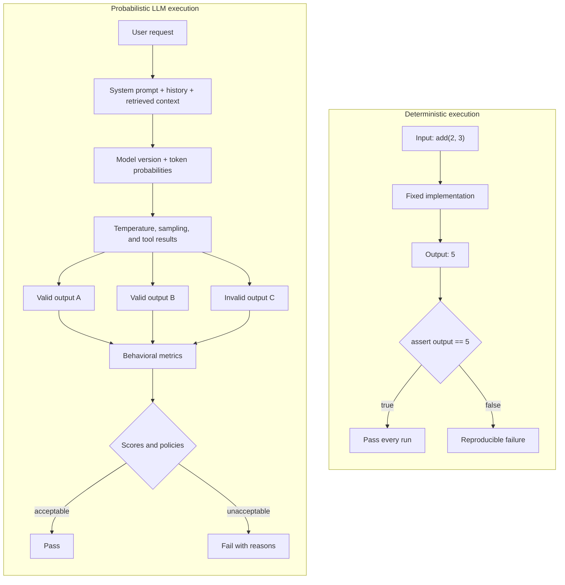
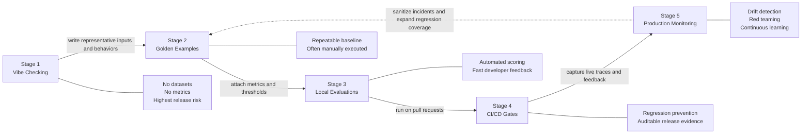

# Chapter 1 — The LLM Evaluation Crisis

[← Master index](../README.md) · [Next: Your First DeepEval Test →](chapter2_basics.md)

## Learning objectives

By the end of this chapter, you should be able to explain why conventional
exact-match testing is insufficient for generative systems, identify vibe
checking in a delivery workflow, distinguish a demonstration from an
evaluation, and place an organization on the AI Quality Maturity Model.

## The demo trap

A language-model feature can produce five impressive answers during a product
demo and still be unsafe for production. The demonstration answers only one
question: *can the system produce a convincing output under these conditions?*
It does not establish:

- how often the behavior occurs;
- which user segments or input classes fail;
- whether the answer is grounded in approved evidence;
- whether a prompt or model change caused a regression;
- whether tool calls were correct and authorized;
- whether the behavior remains stable in production.

When an organization says “we tried it and it looked good,” it has observed a
small, unlabelled sample. It has not defined a requirement, measured a
population, or created a reusable regression asset. That practice is commonly
called **vibe checking**.

## Why exact equality breaks

Consider an expected answer:

```text
Paris is the capital of France.
```

An application might answer:

```text
France's capital city is Paris.
```

The strings differ, but the semantic content is equivalent:

```python
assert actual_output == expected_output  # false negative
```

Replacing equality with a keyword assertion is not enough:

```python
assert "Paris" in actual_output
```

That assertion also accepts “Paris Hilton is an American media personality,” a
response containing the expected token but failing the user task. Exact checks
are too strict for valid paraphrases; keyword checks are too permissive for
meaning.

The evaluation question must therefore change from:

> Did the model produce this exact string?

to:

> Did the observed behavior satisfy the relevant quality criteria?

Those criteria might include answer relevancy, factual grounding, context
coverage, tool correctness, role adherence, safety, or task completion.

## Deterministic and probabilistic architecture




The output distribution can shift when any of the following changes:


| Variable            | Example impact                                                |
| ------------------- | ------------------------------------------------------------- |
| Prompt wording      | A small instruction change alters tone or refusal behavior    |
| Retrieved context   | Missing or stale chunks create unsupported answers            |
| Model version       | Provider updates change reasoning or formatting               |
| Sampling parameters | Temperature increases output variance                         |
| Tool result         | Incorrect upstream data creates a plausible but wrong outcome |
| Conversation state  | Old user details leak into or distort a later turn            |
| Safety layer        | A new guardrail over-refuses legitimate questions             |


## Traditional testing still matters

AI quality engineering extends software testing; it does not discard it.
Deterministic checks remain the best choice for:

- JSON schema and type validation;
- HTTP status and authentication behavior;
- numerical calculations and financial invariants;
- allowlists, denylists, and access control;
- exact tool names and required arguments;
- latency budgets and retry limits;
- PII redaction and encryption boundaries.

Semantic metrics should be added where multiple phrasings may be valid or where
quality depends on meaning. Mature suites combine both.

## The cost of subjectivity

Without reusable evaluations:


| Stakeholder | Consequence                                                  |
| ----------- | ------------------------------------------------------------ |
| Engineering | Cannot distinguish a prompt improvement from random variance |
| QA          | Cannot automate regression coverage for model behavior       |
| Product     | Cannot compare versions against shared acceptance criteria   |
| Operations  | Cannot detect gradual quality drift                          |
| Compliance  | Cannot reconstruct why a release was approved                |
| Leadership  | Receives anecdotes rather than quality evidence              |


Subjectivity also creates key-person risk. If only one expert knows what “good”
looks like, every release depends on that person being available and consistent.
A golden dataset and explicit metrics turn part of that judgment into a shared,
reviewable artifact.

## DeepEval's engineering model

DeepEval treats an LLM interaction as a testable unit. A basic test contains:

```python
from deepeval import assert_test
from deepeval.metrics import AnswerRelevancyMetric
from deepeval.test_case import LLMTestCase

case = LLMTestCase(
    input="What is the capital of France?",
    actual_output="France's capital city is Paris.",
)

metric = AnswerRelevancyMetric(threshold=0.8)
assert_test(case, [metric])
```

The test no longer demands one exact sentence. It evaluates whether the answer
addresses the request and meets a configured acceptance threshold.

The framework's operating principles are:

1. **Local first** — engineers can evaluate behavior before deployment.
2. **Pytest native** — evaluations fit existing test discovery and CI habits.
3. **Metrics over opinions** — quality requirements become measurable.
4. **Component visibility** — traces distinguish retrieval, generation, and
  tool failures.
5. **Production continuity** — local assets evolve into shared datasets,
  release gates, and monitoring.

## AI Quality Maturity Model




### Stage 1 — Vibe checking

Prompts are tried manually, usually against a handful of easy examples.
Acceptance criteria remain implicit. Failures are rediscovered instead of
retained.

### Stage 2 — Golden examples

The team records representative inputs and expected behaviors. This creates a
baseline, but execution and review may still be manual.

### Stage 3 — Local evaluations

Goldens become test cases. Metrics, thresholds, and reasons provide repeatable
feedback during development.

### Stage 4 — CI/CD gates

Evaluations run for pull requests and releases. Material regressions prevent a
merge or deployment. Results become part of the change record.

### Stage 5 — Production monitoring

The system continues to be evaluated after deployment. Real failures, drift,
attacks, and negative feedback become new goldens and controls.

## Shift-left for AI behavior

Prompts, retrieval settings, model identifiers, tools, and safety policies all
change application behavior. They deserve the same controls as source code:

- version control and code review;
- named owners and change history;
- local regression tests;
- CI quality gates;
- rollback procedures;
- release and incident evidence.

The strongest teams ask quantitative questions before shipping:

- Did contextual recall decline after the retriever change?
- Did the refusal prompt improve injection resistance without increasing
harmless-request refusals?
- Did task completion improve, or did the agent merely take more steps?
- Are failures concentrated in one language, customer segment, or document
collection?

## Chapter checklist

- [ ] We can distinguish a demo from a representative evaluation.
- [ ] We maintain expected behavior, not only exact expected strings.
- [ ] We combine deterministic and semantic checks.
- [ ] Prompt and model changes are version-controlled.
- [ ] Quality requirements have owners and measurable thresholds.
- [ ] We know our current maturity stage and the next control to add.

## Key takeaway

LLM uncertainty cannot be eliminated, but it can be managed. The objective of
evaluation is not to make probabilistic software deterministic. It is to create
repeatable evidence, controlled risk, and fast diagnosis around variable
behavior.

[← Master index](../README.md) · [Next: Your First DeepEval Test →](chapter2_basics.md)