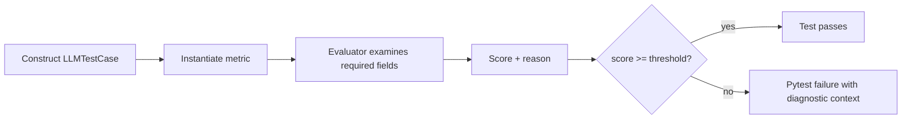

# Chapter 2 — Your First DeepEval Test

[← Chapter 1](chapter1_crisis.md) · [Master index](../README.md) ·
[Next: Understanding Metrics →](chapter3_metrics.md)

## Learning objectives

This chapter establishes a repeatable DeepEval project, explains every major
`LLMTestCase` field, demonstrates Pytest and DeepEval execution, and shows how
to interpret a metric failure without reducing the result to a mysterious
number.

## Project structure

Treat evaluations as production software:

```text
llm-quality/
├── app/
│   └── chatbot.py
├── datasets/
│   └── support_goldens.json
├── tests/
│   ├── conftest.py
│   └── test_answer_quality.py
├── .env.example
├── .gitignore
├── pytest.ini
└── requirements.txt
```

The application code produces behavior. Datasets preserve reusable evaluation
assets. Tests map those assets to metrics and thresholds. Configuration keeps
execution consistent between laptops and CI.

## Environment setup

### macOS and Linux

```bash
python3 -m venv .venv
source .venv/bin/activate
python -m pip install --upgrade pip
python -m pip install deepeval pytest python-dotenv
```

### Windows PowerShell

```powershell
py -3.11 -m venv .venv
.\.venv\Scripts\Activate.ps1
python -m pip install --upgrade pip
python -m pip install deepeval pytest python-dotenv
```

Pin working versions in `requirements.txt` so CI does not silently test a
different dependency graph:

```text
deepeval==4.0.6
pytest==9.1.1
python-dotenv==1.2.2
```

## Credential handling

Many semantic metrics use an evaluator model. Store credentials in a local
ignored file or secret manager:

```dotenv
OPENAI_API_KEY=
OPENAI_MODEL_NAME=gpt-4.1-mini

# Alternative judge provider
ANTHROPIC_API_KEY=
ANTHROPIC_MODEL_NAME=
# USE_ANTHROPIC_MODEL=1

# Azure OpenAI
AZURE_OPENAI_API_KEY=
AZURE_OPENAI_ENDPOINT=
OPENAI_API_VERSION=
AZURE_DEPLOYMENT_NAME=
# USE_AZURE_OPENAI=1
```

Never place real secrets in example files, test parameters, metric reasons,
trace metadata, or captured production datasets. Evaluation telemetry often
contains user input and retrieved text; apply the same classification and
retention rules used for application logs.

## Anatomy of an `LLMTestCase`

The single-turn test case is the core evidence container:

```python
from deepeval.test_case import LLMTestCase, ToolCall

case = LLMTestCase(
    input="Summarize this support ticket.",
    actual_output="The customer requests a refund for a damaged item.",
    expected_output="The customer wants a refund because the item arrived damaged.",
    context=[
        "Refund requests are accepted within 30 days of delivery.",
        "Damaged items qualify for a prepaid return label.",
    ],
    retrieval_context=[
        "Damaged items qualify for a prepaid return label.",
    ],
    tools_called=[
        ToolCall(
            name="lookup_order",
            input_parameters={"order_id": "AC-42"},
        )
    ],
    expected_tools=[
        ToolCall(
            name="lookup_order",
            input_parameters={"order_id": "AC-42"},
        )
    ],
)
```

### Field reference

| Field | Meaning | Common consumers |
|---|---|---|
| `input` | User request or component input | Relevancy, argument correctness, G-Eval |
| `actual_output` | Observed model or application answer | Most output metrics |
| `expected_output` | Ideal answer or required outcome | Contextual recall, task comparison, custom metrics |
| `context` | Authoritative reference information | G-Eval and custom criteria |
| `retrieval_context` | Chunks actually returned by retrieval | Faithfulness and RAG metrics |
| `tools_called` | Observed tool names, inputs, and outputs | Tool and argument metrics |
| `expected_tools` | Required or acceptable tool behavior | Tool correctness |

Not every metric requires every field. Supplying irrelevant fields does not
improve evaluation and may confuse a custom judge. Build each test case around
the evidence needed by its metric portfolio.

## Your first semantic test

```python
from deepeval import assert_test
from deepeval.metrics import AnswerRelevancyMetric
from deepeval.test_case import LLMTestCase


def test_capital_answer_is_relevant():
    case = LLMTestCase(
        input="What is the capital of France?",
        actual_output="France's capital city is Paris.",
    )
    metric = AnswerRelevancyMetric(
        threshold=0.8,
        include_reason=True,
    )
    assert_test(case, [metric])
```

Execution has three conceptual phases:



## Running tests

Use ordinary Pytest for familiar discovery and filtering:

```bash
pytest -v
pytest -v tests/test_answer_quality.py
pytest -v -k "capital"
```

Use DeepEval's runner when you want its evaluation-specific execution and
reporting behavior:

```bash
deepeval test run tests/
deepeval test run tests/test_answer_quality.py -v
```

Both routes use Pytest conventions. The native DeepEval command is generally
preferred for full semantic runs; plain Pytest is useful for fast deterministic
tests and standard debugging.

## Multiple metrics on one behavior

One score rarely captures production quality:

```python
from deepeval.metrics import AnswerRelevancyMetric, FaithfulnessMetric

metrics = [
    AnswerRelevancyMetric(threshold=0.8),
    FaithfulnessMetric(threshold=0.9),
]

assert_test(case, metrics)
```

An answer can be relevant but ungrounded. It can be faithful to retrieved
context but fail to answer the user's question. A metric portfolio should
represent distinct risks rather than several names for the same concern.

## Exploratory evaluation

`assert_test()` is ideal for pass/fail regression tests. Exploratory workflows
often need aggregate results before thresholds are finalized:

```python
from deepeval import evaluate

evaluate(
    test_cases=[case],
    metrics=[metric],
)
```

Use exploratory runs to:

- inspect score distributions;
- compare prompt or model candidates;
- identify weak dataset slices;
- review evaluator reasons with domain experts;
- calibrate thresholds before enforcing CI.

Do not choose a threshold because `0.8` looks conventional. Label acceptable
and unacceptable examples, run the metric, and choose a boundary that provides
the required false-accept and false-reject trade-off.

## Interpreting failures

A failed metric is the beginning of diagnosis:

1. Verify the test-case fields are correct and complete.
2. Read the evaluator reason, not only the score.
3. Inspect the application trace and component spans.
4. Determine whether the fault lies in retrieval, generation, memory, tool use,
   or the test itself.
5. Reproduce the behavior on neighboring goldens.
6. Correct the component or requirement.
7. Retain the failure as a regression asset.

Evaluation code can fail for reasons unrelated to application quality:

| Failure class | Example |
|---|---|
| Test data defect | Expected output contradicts current policy |
| Metric mismatch | Faithfulness used without retrieval context |
| Judge instability | Borderline example changes score across runs |
| Provider problem | Timeout, quota, or invalid credentials |
| Application regression | Prompt begins inventing refund deadlines |

Separate infrastructure failures from quality failures in CI so teams do not
learn to ignore red builds.

## Recommended `pytest.ini`

```ini
[pytest]
testpaths = tests
python_files = test_*.py
addopts = -ra --strict-markers --showlocals --tb=short
markers =
    live_eval: invokes an external evaluator model
    tracing: validates trace and span instrumentation
```

A `live_eval` marker enables a fast local lane:

```bash
pytest -v -m "not live_eval"
```

## Common mistakes

### Testing only polished happy paths

Add ambiguity, missing context, injection attempts, policy boundaries, and user
mistakes. Real users do not follow demo scripts.

### Treating expected output as an exact answer

Write expected behavior or a semantically representative answer. Avoid encoding
irrelevant stylistic details unless style is part of the requirement.

### Using production traffic without sanitization

Remove PII, secrets, account identifiers, and proprietary data before creating
goldens. Preserve the behavioral pattern, not sensitive content.

### Running expensive metrics on every edit

Separate fast deterministic tests, focused local semantic tests, pull-request
gates, and larger scheduled suites. Evaluation depth should increase with
release risk.

## Chapter checklist

- [ ] A clean virtual environment can reproduce the project.
- [ ] Dependencies are pinned.
- [ ] Secrets are excluded from Git and telemetry.
- [ ] Each metric receives its required test-case fields.
- [ ] Live evaluator tests can be separated from fast tests.
- [ ] Failures produce reasons and a diagnosis path.
- [ ] Thresholds are calibrated on labeled examples.

[← Chapter 1](chapter1_crisis.md) · [Master index](../README.md) ·
[Next: Understanding Metrics →](chapter3_metrics.md)

