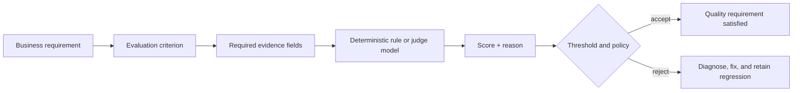
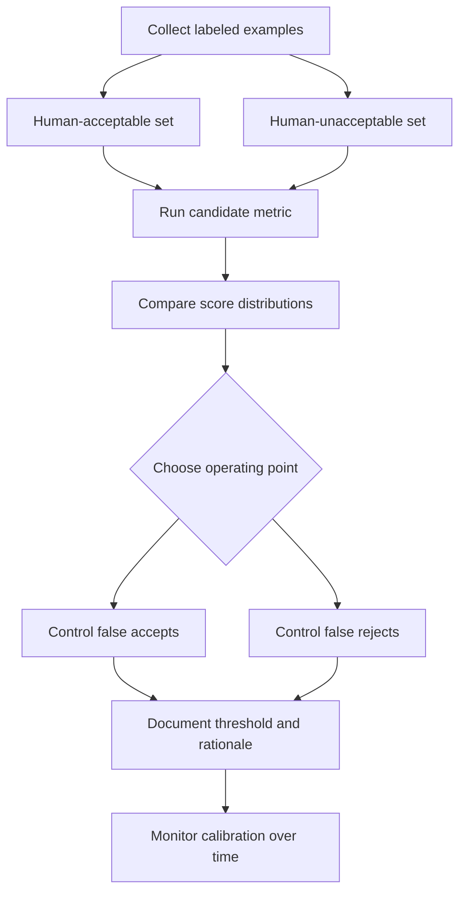

# Chapter 3 — Understanding Metrics Like an Evaluator

[← Chapter 2](chapter2_basics.md) · [Master index](../README.md) ·
[Next: Custom Metrics →](chapter4_custom.md)

## Learning objectives

This chapter explains how metrics convert behavioral requirements into scores,
how deterministic and model-graded evaluators differ, how to choose thresholds,
and how to validate that a metric measures the quality property your team
actually cares about.

## A metric is an operational definition

“The assistant should be good” is not testable. A useful metric operationalizes
one dimension of quality:

- **Answer relevancy:** does the response address the request?
- **Faithfulness:** are claims supported by retrieved evidence?
- **Contextual relevancy:** are retrieved chunks useful for this input?
- **Contextual precision:** are useful chunks ranked ahead of noise?
- **Contextual recall:** did retrieval include the evidence required for the
  expected answer?
- **Tool correctness:** did the agent call the expected tool with the required
  behavior?
- **Role adherence:** did the assistant remain within its assigned role?

The metric, threshold, test-case fields, and failure policy together form the
operational definition of an acceptance criterion.

## Evaluator pipeline



## Deterministic checks versus LLM-as-a-judge

| Attribute | Deterministic evaluator | LLM-as-a-judge evaluator |
|---|---|---|
| Best for | Exact invariants and structured data | Semantic meaning and nuanced behavior |
| Output stability | Usually fully reproducible | May vary at boundaries |
| Latency | Milliseconds | Often seconds |
| Token cost | None or negligible | Input and output token charges |
| Explainability | Explicit rule and failing value | Natural-language reason, sometimes less reproducible |
| Maintenance | Rules must be manually encoded | Criteria can be expressed in natural language |
| Semantic nuance | Limited | Stronger |
| False positives | Caused by incomplete rules | Caused by judge interpretation |
| False negatives | Caused by rigid matching | Caused by weak criteria or judge limitations |
| Offline execution | Easy | Requires a local or remote model |
| Scaling concern | Compute and rule complexity | Cost, rate limits, and evaluator concurrency |

Use deterministic checks when the requirement can be represented as code:

```python
assert response["currency"] == "USD"
assert response["total"] == subtotal + tax
assert tool_call.name in ALLOWED_TOOLS
assert "api_key" not in serialized_trace.lower()
```

Use a judge metric when acceptable behavior has many valid linguistic forms:

```python
AnswerRelevancyMetric(threshold=0.8)
FaithfulnessMetric(threshold=0.9)
```

Hybrid evaluation is often strongest. A booking agent may need an exact
destination airport code, a semantically correct explanation, a faithful fare
summary, and an authorization check before transaction execution.

## Metric inputs define what can be judged

An evaluator cannot assess grounding without evidence or tool correctness
without tool records. The required fields are part of metric design:

| Metric family | Minimum useful evidence |
|---|---|
| Answer quality | `input`, `actual_output` |
| Grounding | `actual_output`, `retrieval_context` |
| Retrieval quality | `input`, `expected_output`, `retrieval_context` |
| Tool behavior | `tools_called`, often `expected_tools` and `input` |
| Conversation quality | ordered turns and assistant role |
| Custom policy | selected fields named in `evaluation_params` |

Missing fields should cause a visible configuration failure, not a silently
meaningless score.

## Scores are not universal truths

A score is conditional on:

- the evaluator model and version;
- the metric prompt or template;
- supplied evidence;
- sampling and execution settings;
- the language and domain;
- the definition of success;
- the dataset distribution.

A faithfulness score of `0.88` is useful only in context. It can be compared
against a calibrated threshold or a previous candidate evaluated under the same
conditions. It should not be presented as an absolute percentage of truth.

## Threshold calibration

Thresholds are policies, not decorative parameters.



Recommended process:

1. Collect examples spanning easy, borderline, and clearly unacceptable cases.
2. Have at least two qualified reviewers label them independently.
3. Resolve disagreements and document the acceptance rubric.
4. Run the metric on the labeled set.
5. Measure how different thresholds classify the examples.
6. Select a threshold based on risk.
7. Recalibrate when the judge model, prompt, domain, or user distribution
   changes.

High-risk behavior should usually optimize against false acceptance. Internal,
low-risk assistance may tolerate a lower boundary to avoid blocking useful
answers.

## Reasons and diagnostic value

Enable reasons during development:

```python
metric = AnswerRelevancyMetric(
    threshold=0.8,
    include_reason=True,
)
```

A score tells you whether a gate passed. A reason helps determine whether:

- the model omitted part of a multi-part request;
- retrieval returned unrelated context;
- the answer made an unsupported claim;
- the criterion itself is ambiguous;
- the expected behavior is outdated.

Reasons should not be treated as infallible chain-of-thought. They are
diagnostic summaries from an evaluator. Validate important conclusions against
the test case, trace, and domain requirement.

## Metric portfolios

Choose metrics by failure mode:

| System risk | Primary metric | Complementary control |
|---|---|---|
| Answers the wrong question | Answer relevancy | Deterministic intent routing check |
| Hallucinates beyond evidence | Faithfulness | Citation and source-ID validation |
| Retrieves noisy chunks | Contextual relevancy | Rank and latency telemetry |
| Misses required evidence | Contextual recall | Index freshness checks |
| Uses the wrong tool | Tool correctness | Tool allowlist |
| Uses wrong arguments | Argument correctness | JSON schema and business rules |
| Takes wasteful steps | Step efficiency | Maximum tool-call and token budgets |
| Forgets user facts | Knowledge retention | Session isolation tests |
| Drifts from role | Role adherence | Hard authorization boundaries |

Avoid redundant portfolios. Five closely related metrics can create cost and
noise without increasing coverage. Each metric should map to a distinct,
actionable failure class.

## Aggregation and release policy

An average can hide critical failures. Suppose 99 FAQ examples score highly and
one medical-safety example scores zero. The average may still look excellent.
Release policies should combine:

- minimum per-example scores for critical slices;
- aggregate medians or percentiles for broad quality;
- zero-tolerance deterministic safety checks;
- segment-level thresholds by language, intent, or risk;
- maximum allowed regression relative to the approved baseline.

Example policy:

```text
Critical safety cases: every case must pass
Faithfulness median: >= 0.90
Faithfulness p10: >= 0.80
Answer relevancy regression: no more than 0.02 below main
Tool authorization failures: exactly zero
```

## Evaluator reliability

Validate the judge like any other dependency:

- compare its decisions with expert labels;
- test paraphrases and ordering effects;
- include adversarial outputs that sound polished but are wrong;
- monitor agreement between repeated runs;
- pin or record evaluator model versions;
- retain the metric prompt and configuration;
- review borderline failures manually;
- use a second evaluator for high-risk disputes.

If a metric cannot reliably separate known good and bad examples, it should not
block deployment.

## Cost and latency engineering

Evaluation can become expensive at scale. Control it through:

- focused pull-request suites and larger nightly suites;
- deterministic prefilters before model grading;
- caching unchanged cases;
- smaller qualified judge models for common checks;
- concurrency within provider limits;
- sampled production evaluation;
- escalation to more capable judges only for borderline cases.

Do not reduce cost by removing the cases that represent the most serious risk.
Optimize execution while preserving coverage.

## Common metric anti-patterns

### One metric for the entire system

“Overall quality” is difficult to diagnose and easy to game. Prefer metrics
aligned with components and failure modes.

### Thresholds copied from tutorials

A threshold meaningful for a general FAQ bot may be unacceptable for financial
or medical advice.

### Judge model equals application model

Using the same model family can create correlated blind spots. Independence is
not guaranteed by using another provider, but evaluator diversity is worth
considering.

### Ignoring data slices

Aggregate results can conceal failures by language, intent, user type,
document source, or adversarial category.

### Treating score movement as causation

A score change after a prompt edit does not prove the edit caused improvement.
Control versions, rerun a stable dataset, and inspect example-level differences.

## Chapter checklist

- [ ] Every metric maps to a named risk and owner.
- [ ] Test cases contain the evidence required by their metrics.
- [ ] Deterministic assertions protect exact invariants.
- [ ] Thresholds are calibrated against human labels.
- [ ] Critical slices cannot be hidden by averages.
- [ ] Evaluator model and metric versions are recorded.
- [ ] Reasons and traces support actionable diagnosis.
- [ ] Cost and latency are managed without deleting high-risk coverage.

## Key takeaway

A metric is useful when it produces decisions that agree with the organization's
definition of acceptable behavior and directs engineers toward a corrective
action. A sophisticated score without calibration, evidence, or ownership is
only a more expensive vibe check.

[← Chapter 2](chapter2_basics.md) · [Master index](../README.md) ·
[Next: Custom Metrics →](chapter4_custom.md)

