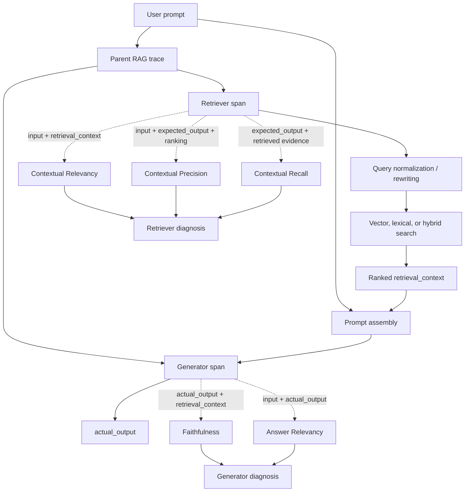
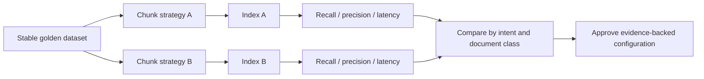

# Chapter 5 — RAG Evaluation: Retriever to Final Answer

[← Chapter 4](chapter4_custom.md) · [Master index](../README.md) ·
[Next: Agent Evaluation →](chapter6_agent.md)

## Learning objectives

This chapter decomposes Retrieval-Augmented Generation into independently
testable components and maps contextual relevancy, precision, recall,
faithfulness, and answer relevancy to the failure modes they diagnose.

## Why end-to-end correctness is insufficient

A RAG answer can fail because:

1. the query was misunderstood;
2. the index lacks current information;
3. retrieval omitted a required chunk;
4. irrelevant chunks outranked useful evidence;
5. generation ignored the evidence;
6. generation invented facts beyond the evidence;
7. the answer was grounded but did not address the request.

An end-to-end “bad answer” result does not identify which component to fix.
Component evaluation turns the pipeline into diagnosable units.

## Component-level RAG matrix



## Metric responsibilities

### Contextual relevancy

Question: *Are the retrieved chunks relevant to the input?*

Low scores indicate noisy retrieval, weak query rewriting, poor filtering, or a
misaligned embedding/index strategy.

### Contextual precision

Question: *Are the useful chunks ranked ahead of irrelevant chunks?*

A retriever can contain the answer while still wasting context-window space by
placing noise first. Precision is especially important when only the top few
chunks reach generation.

### Contextual recall

Question: *Did retrieval include the evidence needed to produce the expected
answer?*

Low recall suggests missing documents, stale indexes, chunking defects, filters
that are too strict, or an insufficient result limit.

### Faithfulness

Question: *Are the claims in the answer supported by retrieval context?*

A faithful answer can still be incomplete or irrelevant. Faithfulness isolates
unsupported generation, contradiction, and hallucination.

### Answer relevancy

Question: *Does the final answer address the user’s request?*

A generator may faithfully summarize retrieved content while ignoring a
multi-part question. Relevancy protects the end-user objective.

## Test-case construction

```python
from deepeval import assert_test
from deepeval.metrics import (
    AnswerRelevancyMetric,
    ContextualPrecisionMetric,
    ContextualRecallMetric,
    ContextualRelevancyMetric,
    FaithfulnessMetric,
)
from deepeval.test_case import LLMTestCase

case = LLMTestCase(
    input="What is the refund window and when will payment arrive?",
    actual_output=(
        "Refund requests are accepted within 30 days of delivery. "
        "Approved refunds return in 5 to 7 business days."
    ),
    expected_output=(
        "The customer has 30 days from delivery to request a refund, "
        "and approved payment takes 5 to 7 business days."
    ),
    retrieval_context=[
        "Refund requests are accepted within 30 days of delivery.",
        "Approved refunds return to the original payment method in 5 to 7 business days.",
    ],
)

metrics = [
    ContextualRelevancyMetric(threshold=0.75),
    ContextualPrecisionMetric(threshold=0.75),
    ContextualRecallMetric(threshold=0.80),
    FaithfulnessMetric(threshold=0.90),
    AnswerRelevancyMetric(threshold=0.85),
]

assert_test(case, metrics)
```

`expected_output` should capture the required facts and behavior. It is a
reference for coverage, not necessarily the only valid wording.

## Failure interpretation matrix

| Relevancy | Precision | Recall | Faithfulness | Likely diagnosis |
|---:|---:|---:|---:|---|
| Low | Low | Low | Variable | Query or index mismatch |
| High | Low | High | High | Correct evidence buried among noise |
| High | High | Low | High | Retrieval is clean but incomplete |
| High | High | High | Low | Generator invents or contradicts claims |
| High | High | High | High, answer relevancy low | Grounded response misses user intent |

This matrix guides action. Do not tune the generator to compensate for missing
retrieval evidence; do not re-index documents to correct unsupported generation.

## Retriever test design

Build goldens around:

- single-fact questions;
- multi-hop questions requiring several chunks;
- date-sensitive policy;
- synonyms and user vocabulary not present in source text;
- ambiguous questions requiring clarification;
- tenant, region, or authorization filters;
- near-duplicate documents;
- obsolete and superseded documents;
- adversarial instructions embedded in retrieved content.

Add deterministic retrieval checks:

```python
assert all(chunk.document_id in allowed_document_ids for chunk in results)
assert all(chunk.tenant_id == current_tenant for chunk in results)
assert results[0].score >= MIN_RETRIEVAL_SCORE
assert latency_ms <= RETRIEVAL_BUDGET_MS
```

Semantic metrics do not replace access-control boundaries.

## Generator test design

Test whether generation:

- uses only supplied evidence for factual claims;
- distinguishes known facts from missing information;
- cites or references sources when required;
- answers every part of a compound request;
- refuses to follow malicious instructions found inside documents;
- does not expose hidden metadata or unrelated context;
- asks a clarifying question when evidence is ambiguous.

Use paired cases where retrieval context is intentionally incomplete. A safe
generator should state that the information is unavailable rather than fill the
gap from intuition.

## Chunking and index experiments

Evaluation makes retrieval changes measurable:



Compare candidate settings on the same goldens and source snapshot. Record:

- chunk size and overlap;
- embedding and reranker versions;
- index build time;
- top-k and score thresholds;
- filters and query-rewrite prompt;
- quality, latency, and cost results.

## Production trace fields

Capture enough metadata to reproduce failures without storing unnecessary
sensitive content:

| Trace field | Diagnostic use |
|---|---|
| Query and normalized query | Detect rewrite defects |
| Source/index version | Identify stale or partial indexes |
| Retrieved document IDs | Reproduce ranking |
| Chunk scores and rank | Diagnose precision |
| Prompt template version | Tie generation to release |
| Model identifier | Detect model drift |
| Citation mapping | Compare claims with evidence |
| Latency and token counts | Balance quality with operations |

Apply data minimization, redaction, and retention controls.

## Common mistakes

### Evaluating only the final answer

This creates a black box and encourages changes to the wrong component.

### Using source documents as retrieval context

`retrieval_context` must represent what the retriever actually returned, not
what was available somewhere in the corpus.

### Treating faithfulness as correctness

An answer can faithfully repeat an outdated or incorrect source. Source quality
and freshness require separate controls.

### Ignoring rank

The presence of a relevant chunk does not help if truncation prevents it from
reaching the model.

## Chapter checklist

- [ ] Retriever and generator are represented by separate spans.
- [ ] Retrieval context reflects actual returned chunks.
- [ ] Goldens include expected facts for recall evaluation.
- [ ] Precision, recall, relevancy, faithfulness, and answer relevancy map to
      distinct failure modes.
- [ ] Access control and schema invariants use deterministic assertions.
- [ ] Index, model, and prompt versions are captured.
- [ ] Production failures can be reproduced from sanitized trace evidence.

[← Chapter 4](chapter4_custom.md) · [Master index](../README.md) ·
[Next: Agent Evaluation →](chapter6_agent.md)

