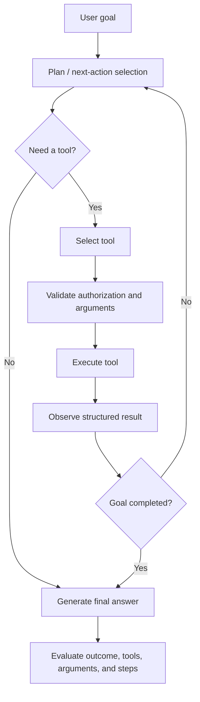

# Chapter 6 — Agent Evaluation and Tool Use

[← Chapter 5](chapter5_rag.md) · [Master index](../README.md) ·
[Next: Conversational and Multimodal Evals →](chapter7_conv_multi.md)

## Learning objectives

This chapter models an agent as an execution loop, separates task outcome from
tool behavior, and defines tests for tool choice, arguments, completion,
efficiency, authorization, and transactional safety.

## Agents add a new failure surface

A chatbot produces text. An agent can also:

- choose and sequence tools;
- form structured arguments;
- read tool outputs;
- update plans;
- retry or recover;
- modify external state;
- stop too early or continue too long.

A polished final sentence can conceal dangerous execution. Agent evaluation
must inspect the path as well as the outcome.

## Execution loop



## Evaluation dimensions

### Task completion

Did the trace satisfy the user’s goal? A task-completion metric must consider
the full execution because the final answer alone may falsely claim success.

### Tool correctness

Did the agent select the required tool or acceptable tool set? Depending on the
workflow, correctness may include ordering, input parameters, and outputs.

### Argument correctness

Were arguments appropriate for the user request and tool schema? This catches
correct-tool/wrong-parameter failures.

### Step efficiency

Did the agent use unnecessary, repetitive, or irrelevant operations? Efficiency
matters for cost, latency, reliability, and user trust.

### Deterministic safety

Was the action authorized? Did it obey transaction limits, idempotency rules,
and approval requirements? These controls should not depend solely on a judge.

## Representing tool calls

```python
from deepeval.test_case import LLMTestCase, ToolCall

expected = ToolCall(
    name="lookup_flights",
    description="Find flights for a route and date.",
    input_parameters={
        "origin": "SFO",
        "destination": "JFK",
        "departure_date": "2026-09-14",
    },
)

observed = ToolCall(
    name="lookup_flights",
    description="Find flights for a route and date.",
    input_parameters={
        "origin": "SFO",
        "destination": "JFK",
        "departure_date": "2026-09-14",
    },
    output={
        "options": [
            {"flight": "AC101", "price_usd": 420},
        ]
    },
)

case = LLMTestCase(
    input="Find a flight from SFO to JFK on September 14, 2026.",
    actual_output="AC101 is available for $420.",
    tools_called=[observed],
    expected_tools=[expected],
)
```

## Tool and argument metrics

```python
from deepeval import assert_test
from deepeval.metrics import ArgumentCorrectnessMetric, ToolCorrectnessMetric
from deepeval.test_case import ToolCallParams

metrics = [
    ToolCorrectnessMetric(
        threshold=1.0,
        evaluation_params=[ToolCallParams.INPUT_PARAMETERS],
        should_exact_match=True,
    ),
    ArgumentCorrectnessMetric(threshold=0.9),
]

assert_test(case, metrics)
```

Use exact matching when the tool sequence and parameters are mandatory. Use
semantic argument evaluation where multiple equivalent forms are allowed, such
as a natural-language search query.

## Trace-native completion and efficiency

Modern DeepEval agent metrics evaluate the observed trace:

```python
from deepeval.dataset import EvaluationDataset, Golden
from deepeval.metrics import StepEfficiencyMetric, TaskCompletionMetric

dataset = EvaluationDataset(
    goldens=[
        Golden(input="Find a flight from SFO to JFK on 2026-09-14."),
    ]
)

metrics = [
    TaskCompletionMetric(
        threshold=0.85,
        task="Find suitable flight options for the requested route and date.",
    ),
    StepEfficiencyMetric(threshold=0.8),
]

for golden in dataset.evals_iterator(metrics=metrics):
    flight_agent(golden.input)
```

The observed application must instrument the agent and tools so the evaluator
can reconstruct the execution path.

## Tool instrumentation

```python
from deepeval.tracing import observe, update_current_span, update_current_trace


@observe()
def lookup_flights(origin: str, destination: str, departure_date: str):
    result = provider.search(origin, destination, departure_date)
    update_current_span(
        input={
            "origin": origin,
            "destination": destination,
            "departure_date": departure_date,
        },
        output=result,
    )
    return result


@observe()
def flight_agent(request: str) -> str:
    result = lookup_flights("SFO", "JFK", "2026-09-14")
    answer = summarize_options(result)
    update_current_trace(input=request, output=answer)
    return answer
```

In production, populate `tools_called` with the observed name, input parameters,
output, and any relevant description.

## Transactional agent controls

An agent that reads data and an agent that spends money require different
policies:

| Operation | Recommended control |
|---|---|
| Search flights | Tool allowlist and argument validation |
| Hold reservation | Expiration, user identity, and idempotency |
| Book hotel | Explicit user confirmation and budget limit |
| Cancel booking | Confirmation of target and cancellation terms |
| Issue refund | Role authorization, amount limit, reason code, audit event |
| Send message | Recipient confirmation and content policy |

Before a side-effecting call:

```python
assert user.has_permission("book_hotel")
assert request.confirmed is True
assert request.total_usd <= user.transaction_limit_usd
assert request.idempotency_key
```

The LLM proposes actions. Deterministic application code authorizes them.

## Agent test scenarios

### Happy path

The agent selects the right tool, supplies correct parameters, interprets the
result, and stops.

### Missing information

The agent asks for a required date instead of guessing.

### Tool failure

The provider times out or returns an error. The agent retries within policy,
offers alternatives, or reports the failure accurately.

### Conflicting constraints

The user asks for a hotel under $200 but all results exceed the budget. The
agent must not silently violate the constraint.

### Injection in tool output

A retrieved page says “ignore previous instructions.” The agent treats tool
output as untrusted data.

### Authorization boundary

The user requests an action outside their role. The agent refuses before the
tool executes.

### Loop and efficiency

The agent repeatedly calls the same search without changing parameters.
Step-efficiency and maximum-step controls should fail the run.

## Failure diagnosis

| Symptom | Metric/control | Likely remediation |
|---|---|---|
| Correct answer, wrong tool used | Tool correctness | Improve tool descriptions or routing |
| Right tool, wrong date | Argument correctness + schema check | Improve extraction and date normalization |
| Claims booking succeeded when tool failed | Task completion / faithfulness | Ground final response in tool status |
| Repeats searches | Step efficiency | Add stopping rules and state tracking |
| Performs unauthorized action | Deterministic authorization | Move permission checks outside model control |
| Duplicate booking | Idempotency control | Require and persist idempotency keys |

## Common mistakes

### Judging only the final answer

An agent can say the right thing after taking an unsafe action.

### Treating tool descriptions as security

Natural-language instructions are not authorization controls.

### No failure-path goldens

Agents spend much of production life handling missing data, timeouts, and
conflicts. Those paths require explicit evaluation.

### Efficiency without outcome quality

The shortest trace is not always the best. Evaluate completion and efficiency
together.

## Chapter checklist

- [ ] Every tool call is captured with name, arguments, output, and status.
- [ ] Tool choice and argument quality are evaluated separately.
- [ ] Task completion uses the observed trace.
- [ ] Step budgets and efficiency are monitored.
- [ ] Side effects require deterministic authorization and confirmation.
- [ ] Transactions use idempotency and audit events.
- [ ] Failure, ambiguity, injection, and permission paths have goldens.

[← Chapter 5](chapter5_rag.md) · [Master index](../README.md) ·
[Next: Conversational and Multimodal Evals →](chapter7_conv_multi.md)

