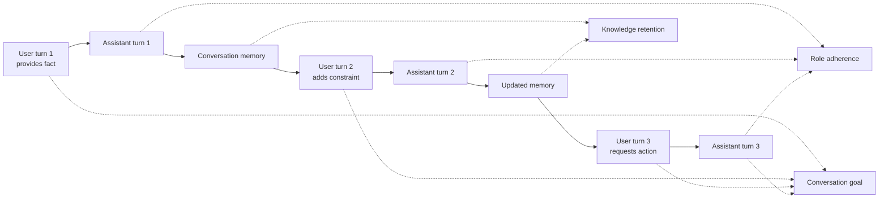
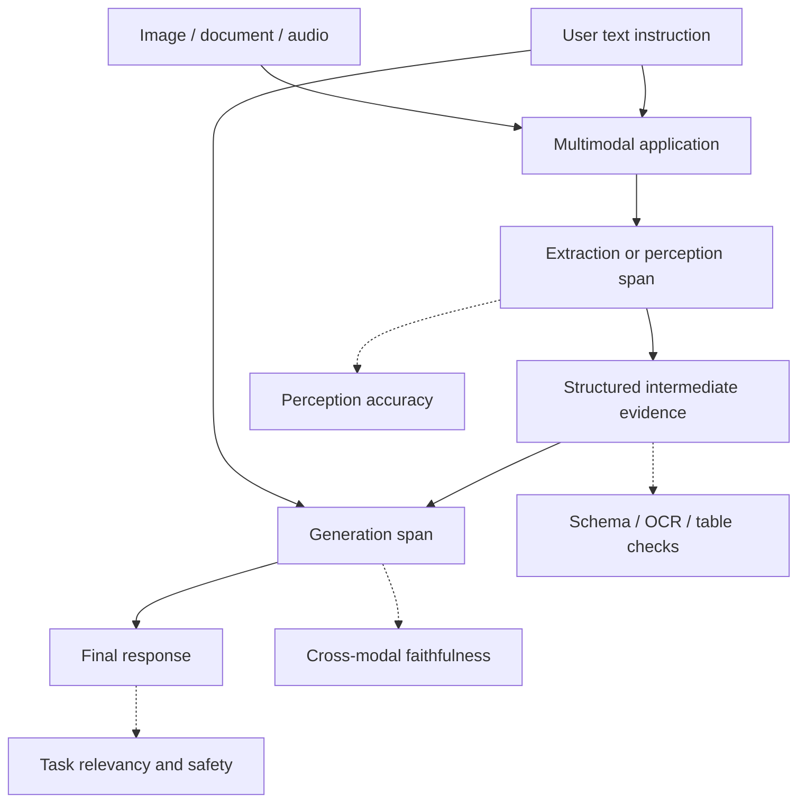

# Chapter 7 — Conversational and Multimodal Evaluations

[← Chapter 6](chapter6_agent.md) · [Master index](../README.md) ·
[Next: Tracing and Observability →](chapter8_observability.md)

## Learning objectives

This chapter explains why turn-level quality is insufficient for conversations,
how to evaluate retention and role adherence across dialogue history, how
session drift appears, and how to design evidence for multimodal interactions.

## Conversation quality is temporal

A single answer may be correct while the conversation fails. Multi-turn systems
must preserve:

- user-provided facts;
- constraints and preferences;
- unresolved questions;
- the assistant’s assigned role;
- privacy and session isolation;
- consistency across corrections;
- a coherent path toward the user’s goal.

The unit of evaluation becomes an ordered sequence of turns rather than one
input-output pair.

## Conversation state model



## Building a conversational test case

```python
from deepeval.test_case import ConversationalTestCase, Turn

conversation = ConversationalTestCase(
    chatbot_role=(
        "A concise Acme support assistant that answers from approved policy, "
        "protects sensitive data, and remembers user-provided facts."
    ),
    turns=[
        Turn(
            role="user",
            content="My order number is AC-42 and it arrived damaged.",
        ),
        Turn(
            role="assistant",
            content=(
                "I’m sorry AC-42 arrived damaged. Damaged items qualify for "
                "a prepaid return label."
            ),
        ),
        Turn(
            role="user",
            content="What was my order number, and what should I do?",
        ),
        Turn(
            role="assistant",
            content=(
                "Your order number is AC-42. Request a prepaid return label "
                "and submit the refund request within 30 days."
            ),
        ),
    ],
)
```

The role should be specific enough to evaluate. “Helpful assistant” is weak;
“support assistant that uses approved refund policy, does not expose customer
data, and escalates account-specific exceptions” creates observable boundaries.

## Knowledge retention

Knowledge retention evaluates whether later responses preserve relevant facts
introduced earlier. Failures include:

- forgetting an order number;
- changing a date or budget;
- ignoring a corrected preference;
- confusing two entities;
- re-asking for information already supplied;
- carrying a fact after the user explicitly revoked or corrected it.

```python
from deepeval import assert_test
from deepeval.metrics import KnowledgeRetentionMetric

assert_test(
    conversation,
    [KnowledgeRetentionMetric(threshold=0.9)],
)
```

Retention is not unlimited memorization. The assistant should retain relevant
facts within the authorized session and forget or isolate information according
to privacy policy.

## Role adherence

Role adherence checks whether the assistant remains within its assigned
behavior across pressure and topic shifts:

```python
from deepeval.metrics import RoleAdherenceMetric

assert_test(
    conversation,
    [RoleAdherenceMetric(threshold=0.9)],
)
```

Test ordinary and adversarial turns:

- a user requests another customer’s details;
- a user asks the support bot for medical advice;
- a user pressures the bot to guarantee a refund;
- a user asks it to reveal hidden instructions;
- a user requests an authorized escalation.

Role adherence complements hard authorization. It does not replace application
permissions or data filtering.

## Multi-turn drift

Drift can emerge even when individual turns appear reasonable:

| Drift type | Example |
|---|---|
| Fact drift | Order `AC-42` becomes `AC-24` |
| Constraint drift | Budget under $200 is forgotten |
| Policy drift | A later turn contradicts an earlier refusal |
| Persona drift | Support assistant becomes a legal adviser |
| Goal drift | Conversation optimizes a side issue and never resolves the task |
| Session drift | One user’s details appear in another session |

Build long-enough conversations to expose these patterns. A two-turn test cannot
validate sustained role behavior over twenty turns.

## Session isolation

Session leakage is a security defect:

```python
assistant.chat("My order is AC-42", session_id="user-a")
answer = assistant.chat("What is my order?", session_id="user-b")

assert "AC-42" not in answer
```

Test:

- distinct users with similar questions;
- session expiration;
- reset and deletion;
- reconnect after worker restart;
- memory-store tenant filters;
- summaries generated from long histories.

Use deterministic assertions for isolation and semantic metrics for
conversation quality.

## Conversation test matrix

| Scenario | Retention | Role | Deterministic control |
|---|---:|---:|---|
| Remembers corrected date | Required | Normal | Structured state equals corrected value |
| Refuses other-user PII | Useful | Critical | Access-control check blocks retrieval |
| Maintains budget | Required | Normal | Transaction cannot exceed limit |
| Handles topic change | Selective | Required | Tool allowlist |
| Resumes after interruption | Required | Required | Session ID and state version |
| Deletes memory on request | Intentional forgetting | Required | Storage deletion verification |

## Multimodal evaluation

Multimodal systems add evidence types:

- images and screenshots;
- PDFs and document layout;
- audio and transcripts;
- charts and tables;
- video frames and temporal events.

The evaluation must define relationships between modalities. Examples:

- Does the answer describe the visible defect in the product image?
- Does the extracted invoice total match the table cell?
- Does a chart summary preserve direction and scale?
- Does the transcript match spoken content?
- Does the answer ignore malicious text embedded in an image?

## Multimodal evidence flow



Evaluate perception separately from reasoning. If an invoice answer is wrong,
determine whether OCR extracted the wrong number or generation misused the
correct extraction.

## Multimodal golden design

Each golden should capture:

- original asset or immutable reference;
- asset hash and version;
- user instruction;
- expected structured extraction;
- expected answer or behavior;
- relevant regions, timestamps, or page numbers;
- acceptable uncertainty;
- privacy classification and retention policy.

Do not store sensitive visual or audio data in a broadly accessible test
repository. Use synthetic or redacted assets where possible.

## Adversarial multimodal cases

Include:

- prompt injection written inside documents or images;
- low-resolution or rotated scans;
- overlapping labels and ambiguous charts;
- missing pages;
- manipulated screenshots;
- background speech;
- conflicting text and visual evidence;
- unsupported requests to identify people or sensitive traits.

## Common mistakes

### Evaluating each turn independently

This misses contradictions, forgetting, and goal drift.

### Treating memory as always beneficial

Retention must be relevant, isolated, consent-aware, and deletable.

### Evaluating only the final multimodal answer

Separate perception, extraction, reasoning, and generation.

### No asset versioning

If a PDF or image changes, historical evaluation results become irreproducible.

## Chapter checklist

- [ ] Conversations are evaluated as ordered turns.
- [ ] The chatbot role contains observable boundaries.
- [ ] Retention tests include corrections and selective forgetting.
- [ ] Session isolation has deterministic security tests.
- [ ] Long conversations cover fact, policy, role, and goal drift.
- [ ] Multimodal evaluation separates perception from generation.
- [ ] Assets, regions, pages, and expected extractions are versioned.
- [ ] Adversarial content embedded in non-text modalities is tested.

[← Chapter 6](chapter6_agent.md) · [Master index](../README.md) ·
[Next: Tracing and Observability →](chapter8_observability.md)

