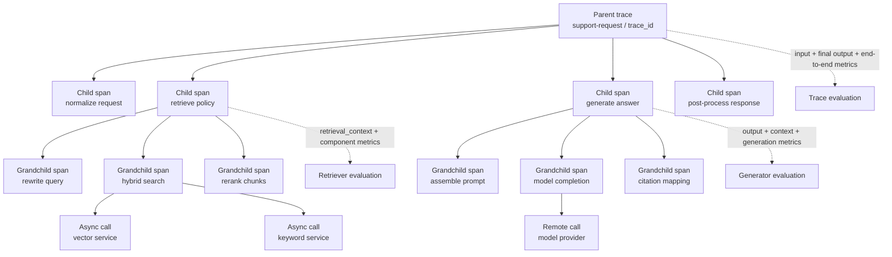
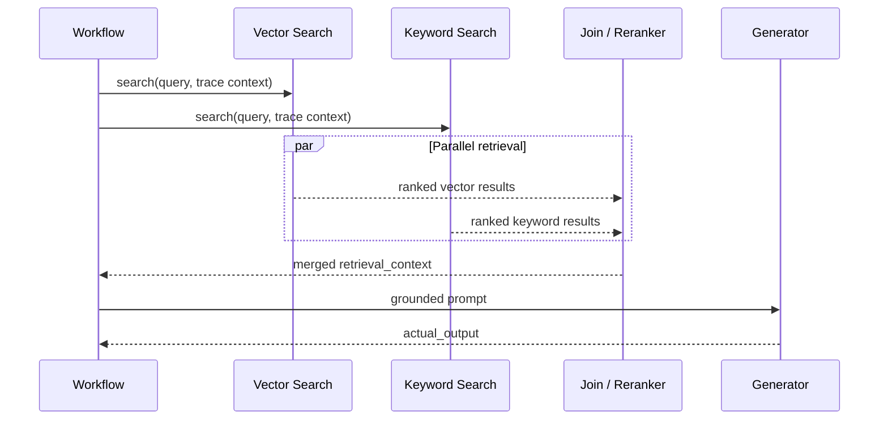
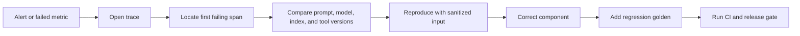

# Chapter 8 — Tracing, Observability, and Component Evaluations

[← Chapter 7](chapter7_conv_multi.md) · [Master index](../README.md) ·
[Next: Synthetic Data and Goldens →](chapter9_synthetic.md)

## Learning objectives

This chapter explains how traces and spans make evaluation diagnosable, how to
instrument components with `@observe()`, how runtime-only fields are attached
with `update_current_span()` and `update_current_trace()`, and how to design
telemetry for asynchronous and distributed LLM applications.

## From output scoring to execution evidence

An end-to-end score tells you whether the observed behavior passed. A trace
shows how the system produced that behavior. For a RAG agent, one trace might
contain:

- request normalization;
- query rewriting;
- retrieval and reranking;
- prompt construction;
- model generation;
- tool selection and execution;
- post-processing;
- final response.

Without component spans, a failure becomes “the chatbot was wrong.” With spans,
the team can identify a stale retriever, malformed tool argument, unsupported
generation, or broken post-processor.

## Distributed trace hierarchy



Parent-child relationships should survive asynchronous execution and service
boundaries through trace-context propagation.

## Instrumentation with `@observe()`

```python
from deepeval.tracing import observe


@observe()
def retrieve_policy(query: str) -> list[str]:
    return vector_store.search(query)


@observe()
def generate_answer(query: str, chunks: list[str]) -> str:
    return model.generate(query=query, context=chunks)


@observe()
def support_workflow(query: str) -> str:
    chunks = retrieve_policy(query)
    return generate_answer(query, chunks)
```

Each decorated function becomes an observed operation. The top-level workflow
forms the parent trace; nested observed functions form child spans.

Use span names and metadata that remain stable across versions. Avoid embedding
high-cardinality or sensitive values directly in names.

## Runtime context injection

Some evaluation fields do not exist when the decorator is declared. Retrieval
context, actual model output, and tool results are available only during
execution:

```python
from deepeval.tracing import (
    observe,
    update_current_span,
    update_current_trace,
)


@observe()
def retrieve_policy(query: str) -> list[str]:
    chunks = vector_store.search(query)
    update_current_span(
        input=query,
        retrieval_context=[chunk.text for chunk in chunks],
    )
    update_current_trace(
        retrieval_context=[chunk.text for chunk in chunks],
    )
    return [chunk.text for chunk in chunks]


@observe()
def generate_answer(query: str, chunks: list[str]) -> str:
    output = model.generate(query=query, context=chunks)
    update_current_span(
        input=query,
        output=output,
        context=chunks,
        retrieval_context=chunks,
    )
    return output


@observe()
def support_workflow(query: str) -> str:
    chunks = retrieve_policy(query)
    output = generate_answer(query, chunks)
    update_current_trace(
        input=query,
        output=output,
        context=chunks,
        retrieval_context=chunks,
    )
    return output
```

`update_current_span()` enriches one component operation.
`update_current_trace()` enriches the end-to-end execution.

## Attaching component metrics

```python
from deepeval.metrics import AnswerRelevancyMetric, FaithfulnessMetric

faithfulness = FaithfulnessMetric(threshold=0.9)
relevancy = AnswerRelevancyMetric(threshold=0.85)


@observe(metrics=[faithfulness])
def generate_answer(query: str, chunks: list[str]) -> str:
    output = model.generate(query=query, context=chunks)
    update_current_span(
        input=query,
        output=output,
        retrieval_context=chunks,
    )
    return output
```

Place the metric at the component boundary where its failure is actionable.
Retriever metrics belong on retrieval spans; faithfulness belongs on the
generation span; task completion often belongs on the full agent trace.

## Trace schema

Recommended fields:

| Dimension | Examples |
|---|---|
| Identity | trace ID, span ID, parent span ID |
| Version | application, prompt, model, index, dataset |
| Routing | tenant, region, intent, feature flag |
| Inputs | sanitized request, structured arguments |
| Outputs | sanitized response, tool status |
| Retrieval | document IDs, ranks, scores, index snapshot |
| Model | provider, model ID, token counts, latency |
| Tool | name, arguments, status, retry count |
| Evaluation | metric name, version, score, threshold, reason |
| Operations | start/end time, error class, timeout, cost |

Do not capture secrets or unrestricted PII merely because a tracing system can
store them. Use field allowlists, hashing, tokenization, redaction, sampling,
and retention policies.

## Asynchronous spans

Parallel retrieval or tool calls can complete out of order. Preserve:

- a shared parent trace context;
- a unique span ID for every operation;
- start and end timestamps;
- status and error data;
- deterministic correlation keys;
- an explicit join span when results are merged.



## Observability versus evaluation

Observability records what happened. Evaluation determines whether it was good.

| Observability signal | Evaluation question |
|---|---|
| Retriever returned five chunks | Were the chunks relevant and complete? |
| Model used 1,800 tokens | Did the response satisfy the task efficiently? |
| Tool returned HTTP 200 | Was it the correct tool and correct outcome? |
| Trace took 4.2 seconds | Is latency acceptable for this user journey? |
| No exception occurred | Was the behavior safe, faithful, and useful? |

Healthy infrastructure can produce poor AI behavior. Both operational and
semantic telemetry are required.

## Sampling strategy

Full production evaluation may be too expensive. Sample by:

- random baseline traffic;
- high-risk intents;
- new prompt or model versions;
- low user ratings;
- escalations and retries;
- unusual tool sequences;
- latency or token outliers;
- suspected attacks;
- underrepresented languages and customer segments.

Always-on deterministic controls should remain active even when semantic
evaluation is sampled.

## Incident diagnosis workflow



## Common mistakes

### Decorating only the top-level request

This produces a trace without component diagnosis.

### Capturing everything

Unbounded telemetry creates security, cost, and retention problems.

### Metrics without required runtime fields

A span-level metric cannot evaluate context that was never attached.

### Unstable names

Dynamic span names make dashboards and comparisons difficult.

### No version metadata

Without prompt, model, and index versions, drift cannot be attributed.

## Chapter checklist

- [ ] End-to-end requests have parent traces.
- [ ] Retriever, generator, agent, and tools have child spans.
- [ ] Runtime evidence is attached with `update_current_span()` or
      `update_current_trace()`.
- [ ] Metrics are attached to actionable component boundaries.
- [ ] Async and distributed calls propagate trace context.
- [ ] Sensitive telemetry is minimized and redacted.
- [ ] Prompt, model, index, and application versions are captured.
- [ ] Production failures can become reproducible goldens.

[← Chapter 7](chapter7_conv_multi.md) · [Master index](../README.md) ·
[Next: Synthetic Data and Goldens →](chapter9_synthetic.md)

