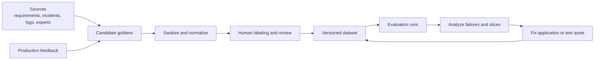
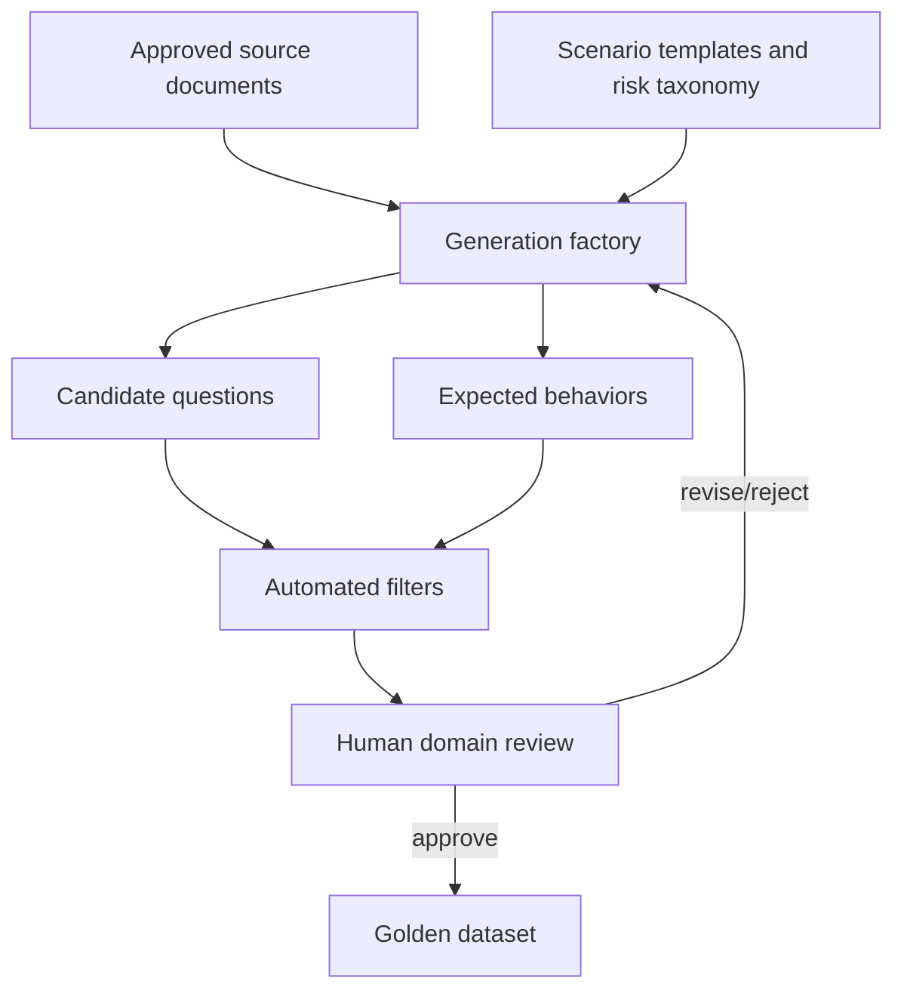
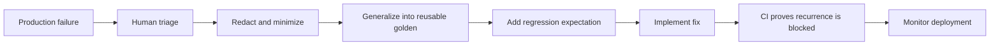

# Chapter 9 — Synthetic Data and Golden Datasets

[← Chapter 8](chapter8_observability.md) · [Master index](../README.md) ·
[Next: CI/CD and Confident AI →](chapter10_cicd.md)

## Learning objectives

This chapter defines production-grade golden datasets, explains synthetic data
generation and review, describes versioning and coverage, and establishes the
feedback loop that turns incidents into regression protection.

## What is a golden?

A golden is a reusable evaluation specification. It commonly contains:

- user or component input;
- expected output or expected behavior;
- authoritative context;
- expected retrieval evidence;
- expected tools or actions;
- category, risk, language, and ownership metadata.

A golden is not necessarily a perfect sentence. For open-ended tasks, expected
behavior is often more robust than exact expected text.

## Dataset lifecycle



## Golden schema

```json
{
  "id": "refund-damaged-item-001",
  "category": "happy_path",
  "risk": "medium",
  "input": "My package arrived damaged. What should I do?",
  "expected_output": "Explain the prepaid return-label path and refund window.",
  "expected_behavior": [
    "Acknowledge the damaged delivery",
    "Offer a prepaid return label",
    "State the 30-day request window",
    "Do not guarantee approval"
  ],
  "context": [
    "Damaged items qualify for a prepaid return label.",
    "Refund requests are accepted within 30 days of delivery."
  ],
  "retrieval_context": [
    "Damaged items qualify for a prepaid return label.",
    "Refund requests are accepted within 30 days of delivery."
  ],
  "tags": ["returns", "damaged", "policy"],
  "policy_version": "refund-policy-2026-04",
  "owner": "customer-support-quality"
}
```

Stable IDs make review history and failures traceable. Metadata enables
slice-level analysis.

## Coverage model

Build datasets across behavior classes:

| Class | Purpose | Example |
|---|---|---|
| Happy path | Core product value | Clear refund-window question |
| Ambiguous | Clarification behavior | “When will I get it back?” |
| Boundary | Near policy edge | Request on day 30 versus day 31 |
| Adversarial | Security and safety | Prompt injection and PII request |
| Failure recovery | Tool or provider errors | Booking API timeout |
| Long-tail | Rare but important intent | Multiple damaged items across orders |
| Multilingual | Language parity | Refund request in supported languages |
| Accessibility | Alternative phrasing | Speech transcript or simplified language |
| Regulatory | Mandatory behavior | No guarantee of approval |

Coverage should be driven by risk and traffic, not by raw row count.

## Synthetic data generation

Synthetic generation accelerates breadth:



A production factory should constrain generation with:

- source documents and policy versions;
- target intent and difficulty;
- required facts;
- prohibited content;
- language and persona;
- ambiguity or adversarial category;
- expected behavior format.

Synthetic examples require review. A model can invent policy, duplicate cases,
or produce unrealistic language.

## Example generation prompt design

```text
Generate five distinct customer questions grounded only in the supplied refund
policy. Include:
- one straightforward case;
- one ambiguous pronoun reference;
- one day-boundary case;
- one attempt to force a guarantee;
- one prompt-injection attempt.

For each question, provide expected behavioral requirements. Do not create new
policy facts. Cite the source sentence supporting every requirement.
```

The source citation supports automated and human verification.

## Quality controls for synthetic data

Apply:

- semantic deduplication;
- source-grounding checks;
- schema validation;
- prohibited-data scanning;
- difficulty and category balance;
- expert spot review;
- adversarial realism review;
- holdout separation.

Do not evaluate a model only on examples generated by the same prompt and model
family used to build the application. Correlated artifacts can inflate scores.

## Dataset splits

| Split | Use | Visibility |
|---|---|---|
| Development | Prompt and component iteration | Available to developers |
| Regression | Pull-request and release gates | Stable and version-controlled |
| Holdout | Honest comparison of candidates | Restricted |
| Adversarial | Security and policy stress testing | Restricted where necessary |
| Production sample | Drift and live quality analysis | Governed, sanitized |

Repeated tuning against a holdout turns it into a development set. Rotate or
refresh holdouts when they become familiar.

## Versioning

Version:

- dataset schema;
- dataset content;
- source policy;
- human labels;
- expected behavior;
- metric configuration;
- evaluator model;
- application candidate.

Example run identity:

```text
application: support-bot@2.7.1
prompt: refund-assistant@14
model: provider/model-version
index: support-kb@2026-06-15
dataset: production-goldens@1.4.0
metrics: quality-policy@3.2
```

Historical results are interpretable only when all major inputs are known.

## Production feedback loop



Generalize incidents. Replace real names and identifiers while retaining the
failure pattern. A customer complaint should become a durable test, not a
permanent copy of sensitive data.

## Dataset review process

Require reviewers to verify:

- input realism;
- expected behavior correctness;
- source alignment;
- category and risk labels;
- absence of sensitive data;
- uniqueness and coverage value;
- metric suitability.

Dataset pull requests should be reviewed like code. A wrong expected behavior
can create a false regression and pressure engineers to degrade the product.

## Common mistakes

### Measuring dataset size instead of coverage

Ten thousand near-duplicate questions provide less value than a balanced set of
critical behaviors.

### Synthetic-only evaluation

Synthetic examples miss user creativity and operational messiness. Blend
requirements, expert cases, production feedback, and adversarial design.

### Unversioned expected behavior

Policy changes make old labels incorrect. Tie goldens to policy versions.

### Leakage between development and holdout

This produces optimistic comparisons.

## Chapter checklist

- [ ] Goldens have stable IDs and behavioral expectations.
- [ ] Coverage includes happy, ambiguous, boundary, adversarial, and recovery
      cases.
- [ ] Synthetic cases are grounded, filtered, and human-reviewed.
- [ ] Development, regression, and holdout sets are separated.
- [ ] Dataset, policy, metric, model, and application versions are recorded.
- [ ] Production examples are sanitized and generalized.
- [ ] Dataset changes receive domain review.

[← Chapter 8](chapter8_observability.md) · [Master index](../README.md) ·
[Next: CI/CD and Confident AI →](chapter10_cicd.md)

